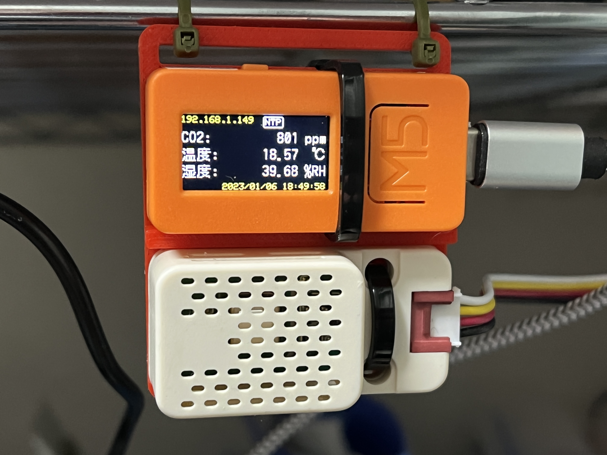

# echonet_sensor

Echonet Lite対応環境（温度、湿度、Co2濃度）センサ

## 外観


## 必要なもの
### ハードウェア
- M5Stack
- M5Stack用SCD40搭載CO2ユニット（温湿度センサ付き）

### ソフトウェア
- platformio.iniで記載しているので、明示的に意識する必要はありません。
- 使用ライブラリ
    - M5Unified@^0.0.7
    - DFRobot_SCD4X@^1.0.1
    - https://github.com/katsumin/EL_dev_arduino.git
        - 杉村博氏によるEchonet Liteプロトコル用ライブラリ（[EL_dev_arduino](https://github.com/Hiroshi-Sugimura/EL_dev_arduino)）を改造して、複数デバイス対応しています。

## 設定
- 動作させるにあたって、定数の設定が必要です。
    - WIFI_SSID
    - WIFI_PASS


## Echonet Lite対応クラス
- 温度センサ（クラスコード：0x0011）
- 湿度センサ（クラスコード：0x0012）
- Co2濃度センサ（クラスコード：0x001B）

## ビルド
- build & upload

  ```
  platformio run --target upload
  ```